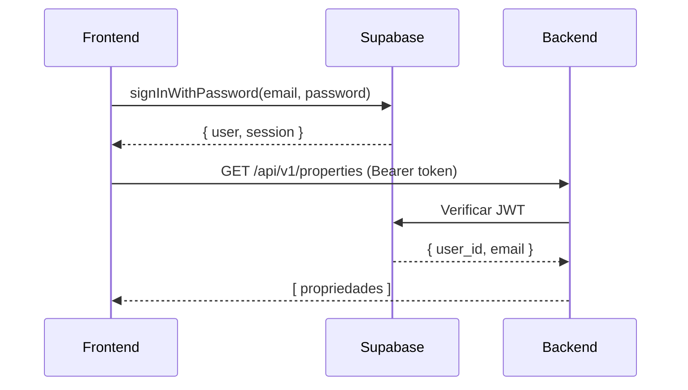

# Guia de Migração - Supabase Auth

Este guia explica como usar o Supabase Auth no monorepo Imobly.

## 📋 Índice

1. [Configuração do Supabase](#configuração-do-supabase)
2. [Backend - Validação JWT](#backend---validação-jwt)
3. [Frontend - Integração](#frontend---integração)
4. [Fluxo de Autenticação](#fluxo-de-autenticação)
5. [Troubleshooting](#troubleshooting)

---

## 1. Configuração do Supabase

### 1.1 Criar Projeto no Supabase

1. Acesse [supabase.com/dashboard](https://supabase.com/dashboard)
2. Clique em "New Project"
3. Preencha:
   - Nome: `Imobly`
   - Database Password: (escolha uma senha forte)
   - Region: Escolha mais próximo (ex: South America)
4. Aguarde criação (~2 minutos)

### 1.2 Obter Credenciais

No Dashboard do projeto:

1. **Settings** → **API**
2. Copie:
   - **Project URL**: `https://xxxxx.supabase.co`
   - **anon/public key**: `eyJhbGciOiJIUzI1NiIsInR5cCI6IkpXVCJ9...`
   - **service_role key**: `eyJhbGciOiJIUzI1NiIsInR5cCI6IkpXVCJ9...`

⚠️ **IMPORTANTE**: `service_role_key` **NUNCA** deve ser exposta no frontend!

### 1.3 Configurar Variáveis de Ambiente

**Backend** (`backend/.env`):
```env
SUPABASE_URL=https://xxxxx.supabase.co
SUPABASE_ANON_KEY=eyJhbGciOiJIUzI1NiIsInR5cCI6IkpXVCJ9...
SUPABASE_SERVICE_ROLE_KEY=eyJhbGciOiJIUzI1NiIsInR5cCI6IkpXVCJ9...
```

**Frontend** (`frontend/.env.local`):
```env
NEXT_PUBLIC_SUPABASE_URL=https://xxxxx.supabase.co
NEXT_PUBLIC_SUPABASE_ANON_KEY=eyJhbGciOiJIUzI1NiIsInR5cCI6IkpXVCJ9...
```

### 1.4 Habilitar Provedores de Auth

**Email/Password** (padrão - já habilitado)

**Google OAuth** (opcional):
1. **Authentication** → **Providers** → **Google**
2. Clique em "Enable"
3. Adicione:
   - **Client ID**: [Obter no Google Cloud Console]
   - **Client Secret**: [Obter no Google Cloud Console]
4. **Authorized redirect URIs**:
   ```
   https://xxxxx.supabase.co/auth/v1/callback
   ```

---

## 2. Backend - Validação JWT

### 2.1 Módulo de Autenticação

O módulo `app/core/supabase_auth.py` já está configurado:

```python
from app.core.supabase_auth import get_current_user, get_current_user_id

@router.get("/properties")
async def list_properties(
    current_user: dict = Depends(get_current_user)
):
    user_id = current_user["id"]
    # ... buscar propriedades do usuário
```

### 2.2 Dependencies Disponíveis

#### `get_current_user`
Retorna dados completos do usuário:
```python
{
    "id": "uuid-do-usuario",
    "email": "usuario@exemplo.com",
    "role": "authenticated",
    "payload": {...}  # JWT payload completo
}
```

#### `get_current_user_id`
Retorna apenas o ID (mais simples):
```python
@router.get("/me")
async def get_profile(user_id: str = Depends(get_current_user_id)):
    return {"user_id": user_id}
```

#### `require_admin`
Exige que o usuário seja admin:
```python
@router.delete("/users/{user_id}")
async def delete_user(
    user_id: str,
    admin: dict = Depends(require_admin)
):
    # Apenas admins podem acessar
```

### 2.3 Endpoints Sem Autenticação

Rotas públicas não precisam de dependency:

```python
@router.get("/health")
async def health_check():
    return {"status": "ok"}
```

---

## 3. Frontend - Integração

### 3.1 Instalar Dependências

```bash
cd frontend
pnpm add @supabase/supabase-js @supabase/auth-helpers-nextjs
```

### 3.2 Cliente Supabase

Criar `frontend/lib/supabase.ts`:

```typescript
import { createClient } from '@supabase/supabase-js'

const supabaseUrl = process.env.NEXT_PUBLIC_SUPABASE_URL!
const supabaseAnonKey = process.env.NEXT_PUBLIC_SUPABASE_ANON_KEY!

export const supabase = createClient(supabaseUrl, supabaseAnonKey)
```

### 3.3 Hook de Autenticação

Criar `frontend/lib/hooks/useAuth.ts`:

```typescript
'use client'
import { useEffect, useState } from 'react'
import { supabase } from '@/lib/supabase'
import type { User } from '@supabase/supabase-js'

export function useAuth() {
  const [user, setUser] = useState<User | null>(null)
  const [loading, setLoading] = useState(true)

  useEffect(() => {
    // Obter sessão atual
    supabase.auth.getSession().then(({ data: { session } }) => {
      setUser(session?.user ?? null)
      setLoading(false)
    })

    // Escutar mudanças de autenticação
    const {
      data: { subscription },
    } = supabase.auth.onAuthStateChange((_event, session) => {
      setUser(session?.user ?? null)
    })

    return () => subscription.unsubscribe()
  }, [])

  return {
    user,
    loading,
    signIn: async (email: string, password: string) => {
      const { error } = await supabase.auth.signInWithPassword({
        email,
        password,
      })
      return { error }
    },
    signUp: async (email: string, password: string) => {
      const { error } = await supabase.auth.signUp({
        email,
        password,
      })
      return { error }
    },
    signOut: async () => {
      await supabase.auth.signOut()
    },
  }
}
```

### 3.4 Componente de Login

```typescript
'use client'
import { useState } from 'react'
import { useAuth } from '@/lib/hooks/useAuth'
import { useRouter } from 'next/navigation'

export function LoginForm() {
  const [email, setEmail] = useState('')
  const [password, setPassword] = useState('')
  const { signIn } = useAuth()
  const router = useRouter()

  const handleSubmit = async (e: React.FormEvent) => {
    e.preventDefault()
    const { error } = await signIn(email, password)
    
    if (error) {
      alert(error.message)
    } else {
      router.push('/dashboard')
    }
  }

  return (
    <form onSubmit={handleSubmit}>
      <input
        type="email"
        value={email}
        onChange={(e) => setEmail(e.target.value)}
        placeholder="Email"
        required
      />
      <input
        type="password"
        value={password}
        onChange={(e) => setPassword(e.target.value)}
        placeholder="Senha"
        required
      />
      <button type="submit">Entrar</button>
    </form>
  )
}
```

### 3.5 Rota Protegida

```typescript
'use client'
import { useAuth } from '@/lib/hooks/useAuth'
import { useRouter } from 'next/navigation'
import { useEffect } from 'react'

export default function DashboardPage() {
  const { user, loading } = useAuth()
  const router = useRouter()

  useEffect(() => {
    if (!loading && !user) {
      router.push('/login')
    }
  }, [user, loading, router])

  if (loading) return <div>Carregando...</div>

  return (
    <div>
      <h1>Dashboard</h1>
      <p>Bem-vindo, {user?.email}!</p>
    </div>
  )
}
```

### 3.6 Chamadas à API Backend

```typescript
import { supabase } from '@/lib/supabase'
import axios from 'axios'

export async function fetchProperties() {
  // Obter token do Supabase
  const { data: { session } } = await supabase.auth.getSession()
  const token = session?.access_token

  // Enviar para Backend
  const response = await axios.get(
    `${process.env.NEXT_PUBLIC_API_URL}/api/v1/properties`,
    {
      headers: {
        Authorization: `Bearer ${token}`,
      },
    }
  )

  return response.data
}
```

---

## 4. Fluxo de Autenticação

### Login Flow



### Passo a Passo

1. **Frontend** chama `supabase.auth.signInWithPassword()`
2. **Supabase** retorna:
   - `user`: Dados do usuário
   - `session`: Inclui `access_token` (JWT)
3. **Frontend** armazena sessão em cookie httpOnly (automático)
4. **Frontend** envia requests para Backend com `Authorization: Bearer {token}`
5. **Backend** valida JWT usando chave pública do Supabase
6. **Backend** extrai `user_id` do token e retorna dados

---

## 5. Troubleshooting

### ❌ "Invalid token" no Backend

**Causa**: Token expirado ou inválido

**Solução**:
```typescript
// Frontend: Refresh token automaticamente
const { data: { session } } = await supabase.auth.getSession()

if (!session) {
  // Forçar login novamente
  router.push('/login')
}
```

### ❌ "CORS error" ao chamar Backend

**Causa**: CORS não configurado

**Solução**: Adicionar origem no `backend/.env`:
```env
BACKEND_CORS_ORIGINS=http://localhost:3000,https://seu-dominio.com
```

### ❌ "User not found" após criar conta

**Causa**: Email não confirmado

**Solução**: Auto-confirmar no Supabase:
```sql
-- No Supabase SQL Editor
UPDATE auth.users 
SET email_confirmed_at = NOW() 
WHERE email = 'usuario@exemplo.com';
```

Ou desabilitar confirmação:
**Authentication** → **Settings** → **Email** → Desabilitar "Enable email confirmations"

### ❌ Google OAuth não funciona

**Causa**: Redirect URI incorreta

**Solução**: Adicionar no Google Cloud Console:
```
https://xxxxx.supabase.co/auth/v1/callback
```

---

## 📚 Recursos Adicionais

- [Supabase Auth Docs](https://supabase.com/docs/guides/auth)
- [Next.js Auth Helpers](https://supabase.com/docs/guides/auth/auth-helpers/nextjs)
- [JWT Debugging](https://jwt.io)

---

## ✅ Checklist de Implementação

- [ ] Projeto criado no Supabase
- [ ] Credenciais copiadas para `.env`
- [ ] Cliente Supabase instalado no frontend
- [ ] Hook `useAuth` implementado
- [ ] Componente de login criado
- [ ] Rotas protegidas implementadas
- [ ] Backend validando JWT corretamente
- [ ] Chamadas à API funcionando com token
- [ ] Google OAuth configurado (opcional)
