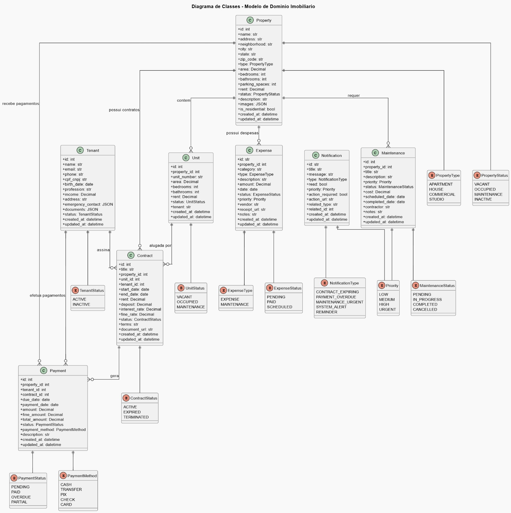
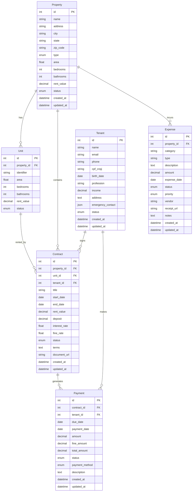
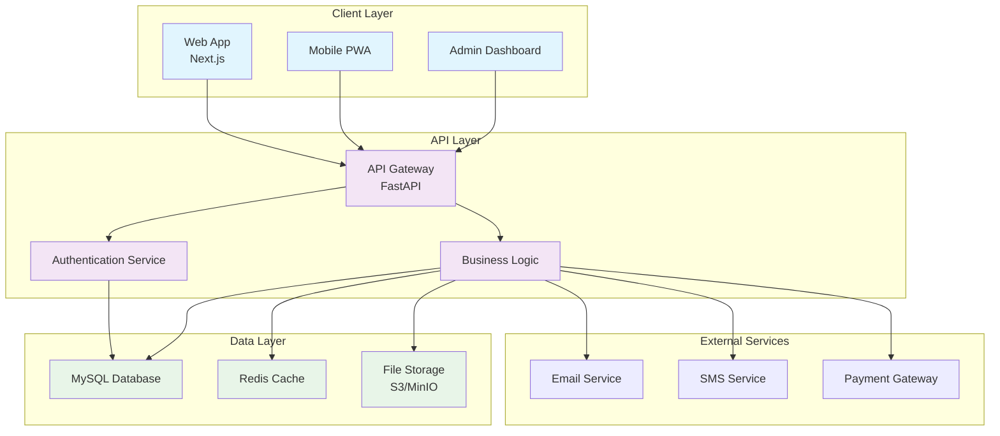

# Modelagem e Diagramas

Esta seção contém todos os diagramas e modelagens do sistema Imobly.

## Diagrama de Classes UML

O diagrama de classes mostra a estrutura principal do sistema:



## Modelagem do Banco de Dados

### Modelo Conceitual



## Diagrama de Arquitetura



## Modelo Físico do Banco de Dados (DDL)

O script DDL completo para criação do banco de dados PostgreSQL está disponível em [`DDL.sql`](DDL.sql).

### Estrutura das Tabelas

#### Users (Usuários)
- Sistema de autenticação e gerenciamento de usuários

#### Properties (Propriedades)
```sql
- id (PK)
- user_id (FK)
- name, address, neighborhood, city, state, zip_code
- type, area, bedrooms, bathrooms, parking_spaces
- rent, status, description, images
- is_residential, tenant_id (FK)
```

#### Units (Unidades)
```sql
- id (PK)
- user_id (FK), property_id (FK)
- number, area, bedrooms, bathrooms
- rent, status, tenant
```

#### Tenants (Inquilinos)
```sql
- id (PK)
- user_id (FK)
- name, email, phone, cpf_cnpj
- birth_date, profession
- emergency_contact (JSON), documents (JSON)
- contract_id (FK), status
```

#### Contracts (Contratos)
```sql
- id (PK)
- user_id (FK), property_id (FK), tenant_id (FK)
- title, start_date, end_date
- rent, deposit, interest_rate, fine_rate
- status
```

#### Payments (Pagamentos)
```sql
- id (PK)
- user_id (FK), property_id (FK), tenant_id (FK), contract_id (FK)
- due_date, payment_date
- amount, fine_amount, total_amount
- status, payment_method, description
```

#### Expenses (Despesas)
```sql
- id (UUID)
- user_id (FK), property_id (FK)
- type, category, description, amount, date
- status, priority, vendor, number
- receipt, documents (JSONB)
```

#### Notifications (Notificações)
```sql
- id (UUID)
- user_id (FK)
- type, title, message, date, priority
- read_status, action_required
- related_id, related_type
```

### Relacionamentos

- **Properties** 1:N **Units** (uma propriedade pode ter várias unidades)
- **Properties** N:1 **Tenants** (propriedade pode ter inquilino atual)
- **Tenants** 1:N **Contracts** (inquilino pode ter múltiplos contratos)
- **Contracts** 1:N **Payments** (contrato gera múltiplos pagamentos)
- **Properties** 1:N **Expenses** (propriedade tem múltiplas despesas)

## Protótipos da Interface

### Documentos do Protótipo

Os protótipos completos do sistema Imobly estão disponíveis em PDF:

- **[📄 Protótipo Completo (PDF)](../prototypes/Protorype.pdf)** - Protótipo detalhado das telas do sistema
- **[📊 Diagrama UML (PDF)](../prototypes/diagramaUML.pdf)** - Diagrama de classes e estrutura

!!! tip "Visualização de PDFs"
    Para melhor visualização, baixe os PDFs e abra em um leitor de PDF. O navegador pode ter limitações de renderização.

## Próximos Diagramas

Esta seção será expandida com:

- **Diagrama de Sequência** - Fluxos de autenticação e operações
- **Diagrama de Casos de Uso** - Funcionalidades do sistema
- **Arquitetura de Deploy** - Infraestrutura de produção

## Arquivos Fonte

- **PlantUML:** `diagramaDeClasses.wsd` - Definição do diagrama de classes
- **DDL:** `DDL.sql` - Script de criação do banco de dados PostgreSQL